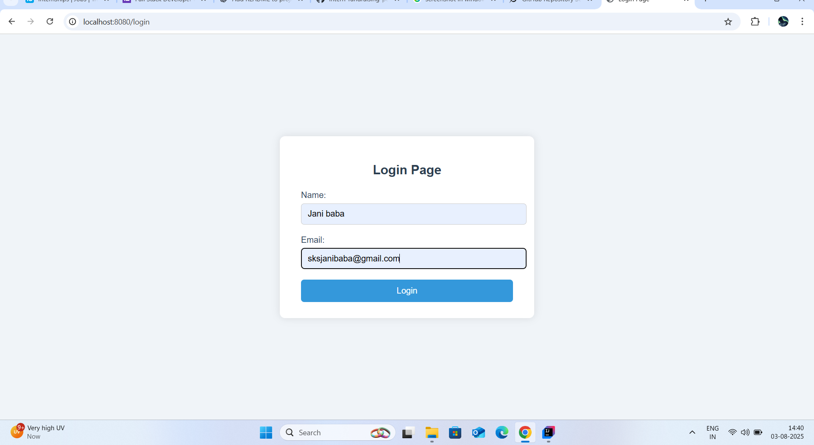
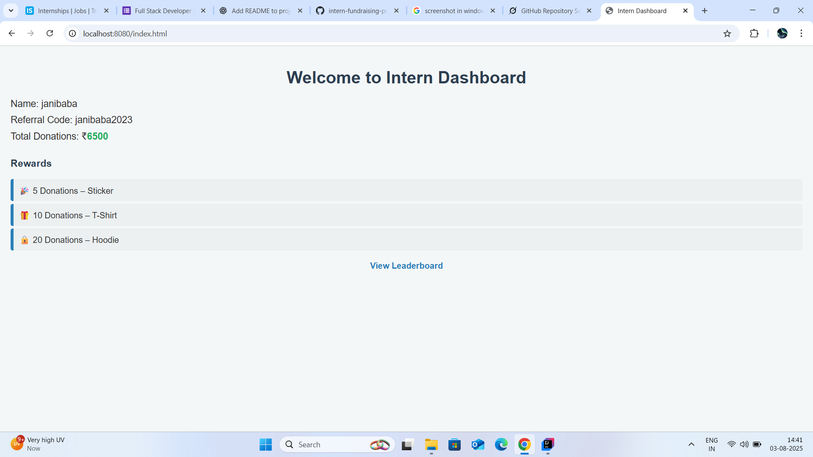

# 🌟 Intern Fundraising Portal

A full stack web application built for managing intern registration, donations, and leaderboard tracking.

---

## 📸 Screenshots

### 🔐 Login Page


### 📊 Dashboard


### 🏆 Leaderboard


> Screenshots are located in the `screenshots/` folder of this repository.

---

## 🛠️ Tech Stack

- **Frontend**: HTML, CSS, JavaScript
- **Backend**: Spring Boot (Java)
- **Tools**: IntelliJ, Git, GitHub

---

## 🚀 How to Run Locally
1.Type localhost:8080/login for login page
2.Type localhost:8080/index for login page
3.Type localhost:8080/leadership for login page

### 🔧 Backend (Spring Boot)

1. Clone this repository:
   ```bash
   git clone https://github.com/sksjanibaba/intern-fundraising-portal.git


